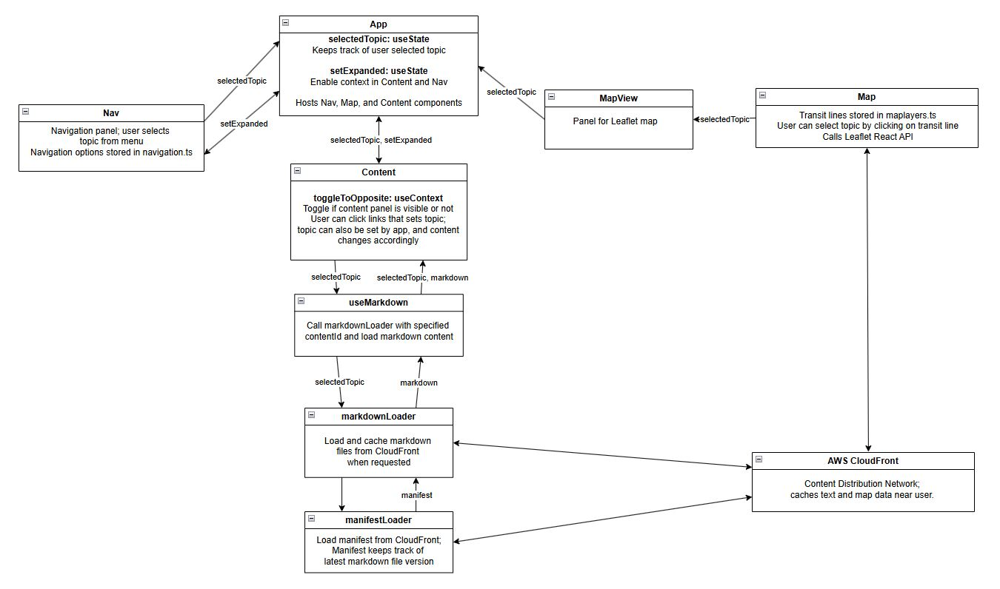
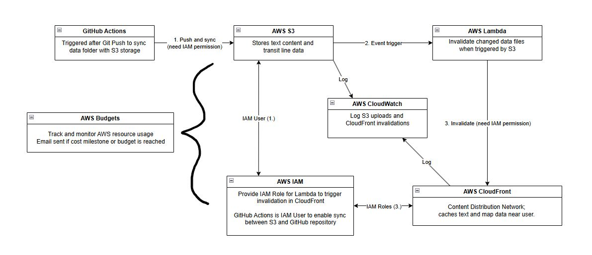

# Transport 2055

## Frontend Flow Diagram

This is the general flow graph for the frontend, where state management is handled in App.tsx. 

## Backend Flow Diagram

This is the flow graph for the backend, which uses Amazon Web Services to host and distribute files. GitHub Actions, after a Git Push, synchronizes Markdown and GeoJSON data in this repository with AWS S3, which then triggers an AWS Lambda function to invalidate changed files so that AWS CloudFront always serves the latest file version\(s\). Logging and monitoring are handled by AWS CloudWatch and Budgets. 

# Previous Text
## A long-range network framework for Metro Vancouver and the Lower Mainland

Welcome to Transport 2055! This is my take on what should be built within the next 30 years in terms of rapid transit and passenger rail in Metro Vancouver, and to a lesser extent, the Fraser Valley and Sea-to-Sky. While Transport 2055 is centered on Metro Vancouver, it acknowledges that travel patterns, labour markets, and rail corridors extend beyond regional boundaries. 

Transport 2055 is not a funding plan or construction schedule. 
It is a network framework intended to guide decisions as opportunities arise. 

This plan is heavily based on real world expansion plans/concepts, and also the work of Reece Martin of RMTransit and the Mountain Valley Express Collective Society, linked below. 

https://www.youtube.com/watch?v=qZavPFZ9H1E \
https://www.mvx.vision/

